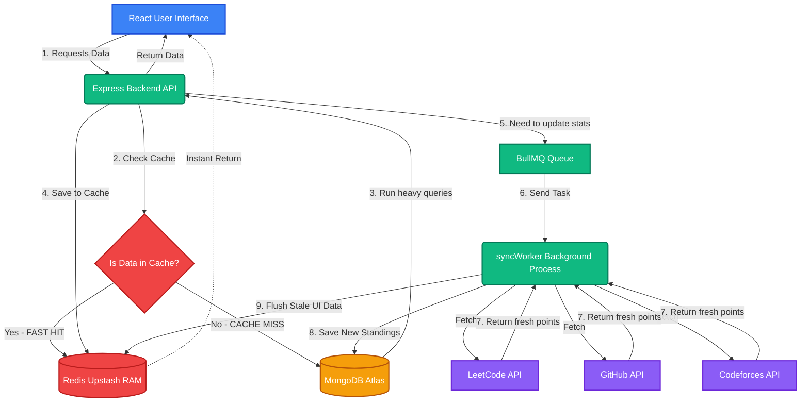

# CodeVerse - System Flowchart

Here is the complete application flow presented in block format to show exactly how data moves through the CodeVerse platform.

## 1. Primary Request Flow (User Journey)

When a user visits the dashboard or views leaderboards, the system prioritizes speed using our caching block diagram:

```text
+-----------------------------+
|                             |
|    React Frontend (Vite)    |   User clicks "Dashboard" or "Daily Challenge"
|       (Fast UI Mount)       |
|                             |
+--------------+--------------+
               | 1. HTTP GET Request
               v
+--------------+--------------+
|                             |
|     Express Backend API     |   Receives request
|     (Node.js / Express)     |
|                             |
+--------------+--------------+
               | 2. Intercepts request
               v
+--------------+--------------+             +---------------------------+
|                             |  Hit (Yes)  |                           |
|  Redis Cache Middleware     +------------>|  RETURN DATA IMMEDIATELY  |
|  (Upstash RAM ~140ms Load)  |             |  (Bypasses DB entirely)   |
|                             |             +-------------+-------------+
+--------------+--------------+                           |
               | Miss (No)                                |
               v                                          |
+--------------+--------------+                           |
|                             |                           |
|     MongoDB Atlas (DB)      |                           |
| (Heavy Aggregation Queries) |                           |
|                             |                           |
+--------------+--------------+                           |
               | 3. Returns aggregated data               |
               v                                          |
+--------------+--------------+                           v
|                             |                 (Result rendered 
|  Save to Redis Cache RAM    |                  on user screen)
|                             |
+-----------------------------+
```

---

## 2. Background Sync Flow ( Automated Data Fetching )

To prevent the website from freezing while waiting for Github or LeetCode to respond, CodeVerse uses a background queue system:

```text
+-----------------------------+
|                             |
|     Express Backend API     |  Triggers when user profile needs update
|                             |
+--------------+--------------+
               | 1. Enqueue Job
               v
+--------------+--------------+
|                             |
|   BullMQ Queue Engine       |  Holds tasks in memory safely
|   (Powered by Redis)        |
|                             |
+--------------+--------------+
               | 2. Passes Job to Worker
               v
+--------------+--------------+
|                             |
|   syncWorker.js Process     |  Background worker starts processing
|                             |
+---+----------+----------+---+
    |          |          |     3. Fetches live competitive stats
+---v---+  +---v---+  +---v---+
| Leet- |  | GitHub|  | Code- | 
| Code  |  |  API  |  | forces|
+-------+  +-------+  +-------+
    |          |          |     4. Stats returned
    +----------+----------+
               |
               v
+--------------+--------------+
|                             |
|     MongoDB Atlas (DB)      |  Updates the user's records & leaderboards
|                             |
+--------------+--------------+
               | 5. Triggers Cache Invalidation
               v
+--------------+--------------+
|                             |
|    Upstash Redis Cache      |  Deletes stale cache for this user
|    (Flushed / Cleared)      |  Next user request triggers a fresh DB fetch
|                             |
+-----------------------------+
```

---

## Interactive Diagram (Auto-Renders in VSCode or GitHub)

If you use a MarkDown previewer, this node-based flowchart graphically illustrates the application:


