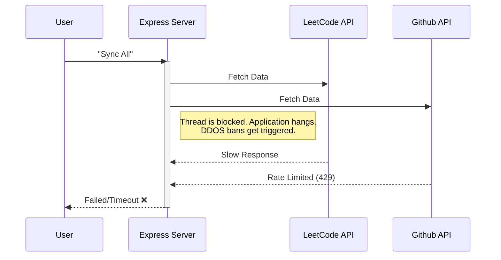
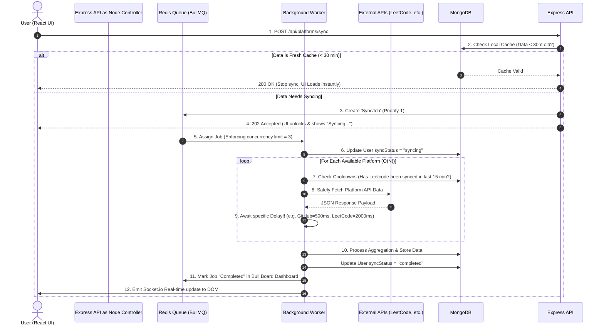

# Advanced Platform Sync Architecture

This diagram visualizes exactly how the highly scaled, robust 18-step asynchronous data sync feature functions behind the scenes in CodeVerse. 

## Flowchart: Before vs After (Visualized)

### 🚨 BEFORE: Linear Blocking Architecture (Flawed)
When users triggered a sync, the UI hung until external servers replied. If the target server failed or took 10 seconds, Express locked that thread.

---

### 🟢 AFTER: Queue-Based Worker Architecture (Current System)
Instead of waiting, Express drops the request onto a caching queue using **Upstash Redis** and immediately frees the HTTP thread. 
A separate background worker processor (or multiple!) pulls from the queue securely.

### Component Details
1. **Node Controllers (`platformController.js`)**: Evaluates user spam limits and checks the Mongo cache timestamp. 
2. **Upstash Redis (`redis.js`)**: Serverless KV store that hosts list items securely.
3. **Queue Logic (`syncQueue.js`)**: Instructs Upstash on Retry Backoff attempts. If the external fetch fails, BullMQ waits 5 seconds and reschedules it exponentially. 
4. **The Process Worker (`syncWorker.js`)**: Isolated loop running alongside the server polling off jobs safely without using main thread resources.
5. **Insights Dashboard (`Bull Board`)**: Plugs directly into Express offering `localhost:5000/admin/queues` insight visualizer.
